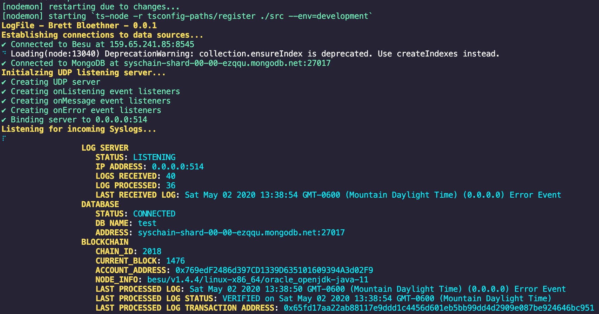

# Syschain
#### Brett Bloethner | CSCI E-118 Final Prject

## Project Summary
#### Overview
The Syschain project was created to help improve the storage of critical networked device logs using a combination of the syslog utility found in most networked devices and the ethereum blockchain. From a high level, the Syschain application used the blockchain as an immutable storage medium for log file digest hashes. These hashes can then be used to validate the integrity of ingested syslogs for cyber security monitoring and incident response applications. Oftem times, cyber ciminals attempt to cover their tracks through the modification of system logs. This utility is meant to help combat that.

#### Design
The design of this application relies havily on a Typescript/Javascript command line application. This application acts as a Syslong receiving server that ingests syslogs from any server or networked device thats setup to send logs to the machine running this application. Once the a Syslog is received, this application then saves the log to a MongoDB data store solution and creates a digest of the log.  The application then saves the log digest as a transaction in the blockchain. The application interfaces with any Ethereum powered blockchain using the Web3 platform. MongoDB is used in order to allow fast access to log entries. Each log entry includes the transaction ID, that way it's validaity can be varified in the blockchain. In order to demonstrate the application, I've ccreated a simple dashboard in MongoDBs cloud database solution, Atlas. In an ideal operating environment, a dedicated data visualization app like Tablaeu would be used to visualize both the full text log entries from MongoDB as well as the blockchains transactions and the logs' validity in realtion to the blockchain. The application design is realitivly simply despite the implimentation being somewhat complex.

Devices producing he log files must be able to connect to the server running the this application. The can run locally on the same machine, connect over LAN or over a VPN in a WAN. The method of connectivity is really up to the adminstrator. The devices must also be able to stream Syslogs to the application on whichever port is specified in the application.

The application itself has three main requirements. It must be run on a machine with internet access that is capable of running the NodeJS runtime. It must also have access to a blockchain that can interface with the Web3 library. Lastley, it must have access to a MongoDB database. For my demonsration, I chose to use MongoDBs cloud database solution called Atlas. Unfortnatly, I couldnt find a suitable cloud blockchain solution so I had to run the Hyperledger Besu blockchain locally on a small machine at home. In the future, either of the data stores could be living in the cloud, locally, or somewhere in the LAN.

The applications interface provides status updates on the counts of logs and other various metrics. There are no controls beyond the startup command and options flags.

---
## Getting Started (Linux or OSX)
1. Install the NodeJS runtime
2. Clone the github repository
3. Install all the projects dependencies
4. Run the Syslog Generator
5. Run the Syschain command line application
6. Continue on to the next section, "Verifying Functionality"

---
## Verifying Functionality
This project design is relativly complex when compared to simple contracts. Unfortuantly, this means that verifying the app is also relativly complex. In this section, I will go step by step showing how you can view dashboard data and make conclusions from the data, showing that the application is working as expected.

#### Terminal Dashboard
Ther terminal dashboard is rudiementary dashboard you'll see in the termainl once you start the application. Each parameter is described in the section below the image.

- LOG SERVER
  - STATUS
  - IP ADDRESS:
  - LOGS RECEIVED:
  - LOGS PROCESSED:
  - LAST RECEIVED LOG:
- DATABASE
  - STATUS:
  - DB NAME:
  - ADDRESS:
- BLOCKCHAIN
  - CHAIN ID:
  - CURRENT BLOCK:
  - ACCOUNT ADDRESS:
  - NODE INFO:
  - LAST PROCESSED LOG:
  - LAST PROCESSED LOG STATUS:
  - LAST PROCESSED LOG TRANSACTION ADDRESS:

#### Mongo Atlas Dashboard

#### Hyperledger Besu Grafana Dashboard

#### Hyperledger Besu Block Explorer

---
## Cloud Configurations and Locations
#### MongoDB Atlas
- MongoDB Atlas Address               : mongodb+srv://<username>:<password>@syschain-ezqqu.mongodb.net/test?retryWrites=true&w=majority
- MongoDB Atlas Dashboard             : https://charts.mongodb.com/charts-syschian-kecaa/public/dashboards/58659a27-cacc-4a48-bd50-fc993301d554
#### Hyperledger Besu Blockchain
- JSON-RPC HTTP service endpoint      : http://159.65.241.85:8545
- JSON-RPC WebSocket service endpoint : ws://localhost:8546
- GraphQL HTTP service endpoint       : http://localhost:8547
- Web block explorer address          : http://159.65.241.85:25000/
- Prometheus address                  : http://159.65.241.85:9090/graph
- Grafana address                     : http://159.65.241.85:3000/d/XE4V0WGZz/besu-overview?orgId=1&refresh=10s&from=now-30m&to=now&var-system=All

